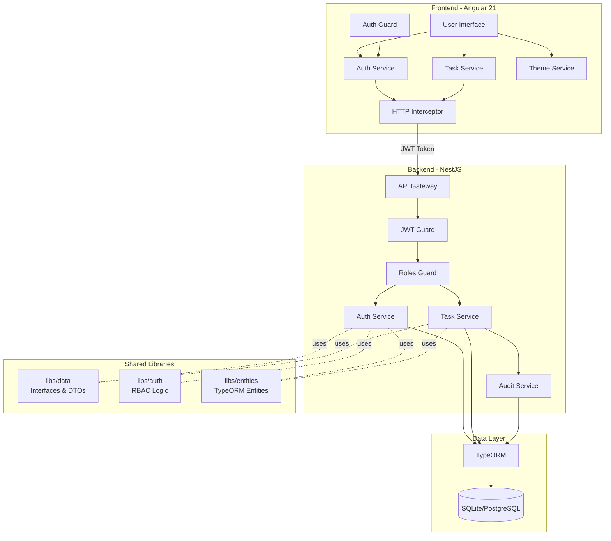
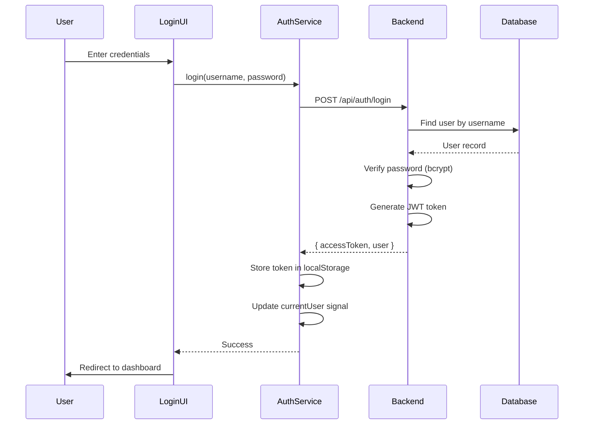
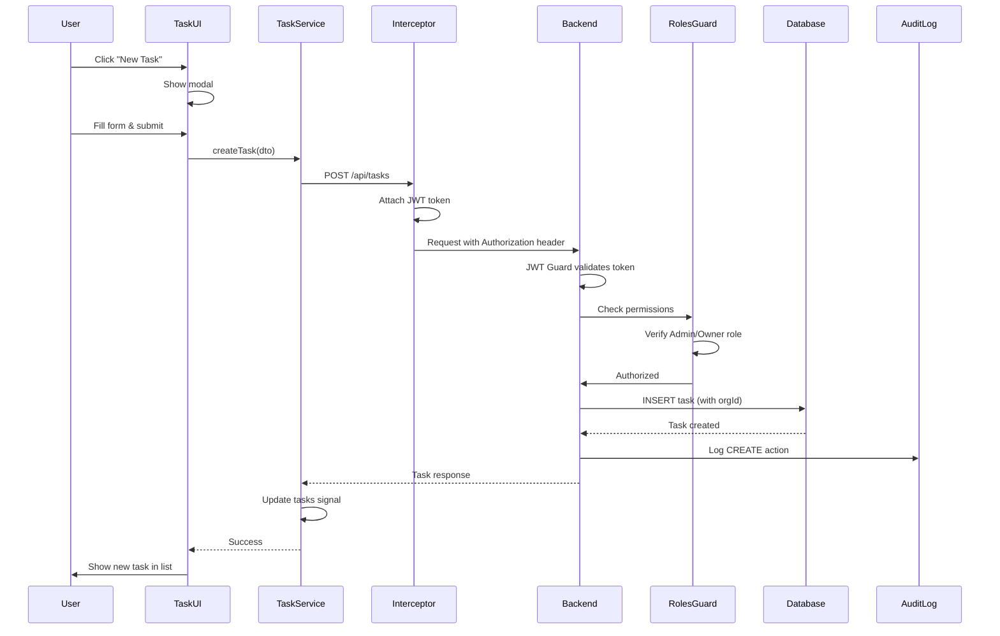
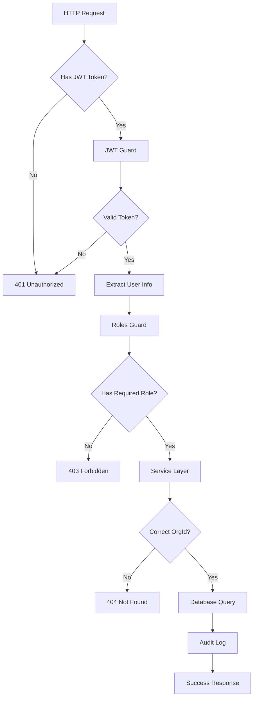

# Architecture Overview

## System Architecture



## NX Monorepo Structure

```
secure-task-management-system/
├── apps/
│   ├── api/                    # NestJS Backend
│   │   ├── src/
│   │   │   ├── app/
│   │   │   │   ├── auth/       # Auth controller
│   │   │   │   ├── tasks/      # Tasks module
│   │   │   │   ├── entities/   # (symlink to libs/entities)
│   │   │   │   ├── app.module.ts
│   │   │   │   └── seed.service.ts
│   │   │   └── main.ts
│   │   └── .env                # Environment config
│   │
│   ├── api-e2e/                # Backend E2E Tests
│   │   └── src/api/api.spec.ts
│   │
│   ├── dashboard/              # Angular Frontend
│   │   ├── src/
│   │   │   ├── app/
│   │   │   │   ├── components/
│   │   │   │   │   ├── login/
│   │   │   │   │   ├── dashboard/
│   │   │   │   │   ├── task-list/
│   │   │   │   │   ├── task-modal/
│   │   │   │   │   └── audit-log/
│   │   │   │   ├── services/
│   │   │   │   │   ├── auth.service.ts
│   │   │   │   │   ├── task.service.ts
│   │   │   │   │   └── theme.service.ts
│   │   │   │   ├── guards/
│   │   │   │   │   └── auth.guard.ts
│   │   │   │   ├── interceptors/
│   │   │   │   │   └── auth.interceptor.ts
│   │   │   │   ├── app.config.ts
│   │   │   │   └── app.routes.ts
│   │   │   └── styles.css
│   │   └── tailwind.config.js
│   │
│   └── dashboard-e2e/          # Frontend E2E Tests
│
├── libs/
│   ├── data/                   # Shared TypeScript Interfaces
│   │   └── src/lib/
│   │       └── data.ts         # User, Task, DTOs, Enums
│   │
│   ├── auth/                   # Reusable RBAC Logic
│   │   └── src/lib/
│   │       ├── auth.module.ts
│   │       ├── auth.service.ts
│   │       ├── jwt.strategy.ts
│   │       ├── jwt-auth.guard.ts
│   │       ├── roles.guard.ts
│   │       └── roles.decorator.ts
│   │
│   └── entities/               # TypeORM Entities
│       └── src/lib/
│           └── entities.ts     # User, Org, Task, AuditLog
│
├── docs/
│   ├── ERD.md                  # Database schema & diagrams
│   ├── API.md                  # API documentation
│   └── ARCHITECTURE.md         # This file
│
├── nx.json                     # NX workspace config
├── package.json
└── README.md
```

## Technology Stack

### Backend

- **Framework**: NestJS 11.x
- **ORM**: TypeORM 0.3.x
- **Database**: SQLite (dev) / PostgreSQL (production)
- **Authentication**: JWT (Passport.js)
- **Password Hashing**: bcrypt
- **Testing**: Jest + Supertest

### Frontend

- **Framework**: Angular 21.x (Standalone Components)
- **State Management**: Angular Signals
- **Styling**: TailwindCSS 3.x
- **HTTP Client**: Angular HttpClient
- **Drag & Drop**: Angular CDK
- **Testing**: Jest + Angular Testing Library

### Shared

- **Monorepo**: NX 22.x
- **Language**: TypeScript 5.9.x
- **Package Manager**: npm

## Request Flow

### Authentication Flow



### Task Creation Flow



## Security Architecture

### Multi-Layer Security



### Security Layers

1. **Transport Layer**: HTTPS (production)
2. **Authentication Layer**: JWT token validation
3. **Authorization Layer**: Role-based access control (RBAC)
4. **Data Layer**: Organization-scoped queries
5. **Audit Layer**: All actions logged

### Password Security

- **Hashing**: bcrypt with salt rounds = 10
- **Storage**: Never stored in plain text
- **Validation**: Constant-time comparison

### JWT Token

- **Algorithm**: HS256
- **Expiration**: 24 hours (configurable)
- **Payload**: `{ userId, username, role, orgId }`
- **Secret**: Environment variable (not hardcoded)

## State Management (Frontend)

### Angular Signals Architecture

```typescript
// Reactive state with automatic UI updates
authService.currentUser = signal<User | null>(null);
taskService.tasks = signal<Task[]>([]);
themeService.isDarkMode = signal<boolean>(true);

// Computed values
isAuthenticated = computed(() => !!currentUser());
completionRate = computed(() => {
  const total = tasks().length;
  const done = tasks().filter((t) => t.status === 'Done').length;
  return (done / total) * 100;
});
```

### Benefits

- **Automatic Change Detection**: UI updates when signals change
- **Performance**: Fine-grained reactivity
- **Type Safety**: Full TypeScript support
- **Simplicity**: No boilerplate like NgRx

## Scalability Considerations

### Current Architecture (Assessment)

- SQLite for simplicity
- In-memory session storage
- Single-server deployment

### Production Recommendations

#### Database

- **PostgreSQL**: Production-grade RDBMS
- **Connection Pooling**: Optimize concurrent connections
- **Indexes**: Add indexes on frequently queried columns
- **Migrations**: Use TypeORM migrations for schema changes

#### Caching

- **Redis**: Cache user sessions and permissions
- **Query Results**: Cache frequently accessed data
- **TTL Strategy**: Invalidate on updates

#### Horizontal Scaling

- **Load Balancer**: Distribute traffic across multiple instances
- **Stateless API**: JWT tokens enable stateless authentication
- **Database Replication**: Read replicas for query performance

#### Security Enhancements

- **Refresh Tokens**: Implement token rotation
- **Rate Limiting**: Prevent brute-force attacks
- **CSRF Protection**: Add CSRF tokens for state-changing operations
- **Helmet.js**: Security headers
- **Input Validation**: Class-validator on all DTOs

#### Monitoring & Observability

- **Logging**: Structured logging (Winston/Pino)
- **Metrics**: Prometheus + Grafana
- **Tracing**: OpenTelemetry
- **Error Tracking**: Sentry

## Testing Strategy

### Backend Tests

- **Unit Tests**: Services, guards, decorators
- **Integration Tests**: Database interactions
- **E2E Tests**: Full API workflows with authentication

### Frontend Tests

- **Component Tests**: UI logic and rendering
- **Service Tests**: HTTP calls and state management
- **E2E Tests**: User flows (Playwright)

### Coverage Goals

- **Backend**: >80% code coverage
- **Frontend**: >70% code coverage
- **Critical Paths**: 100% (auth, RBAC, task CRUD)
