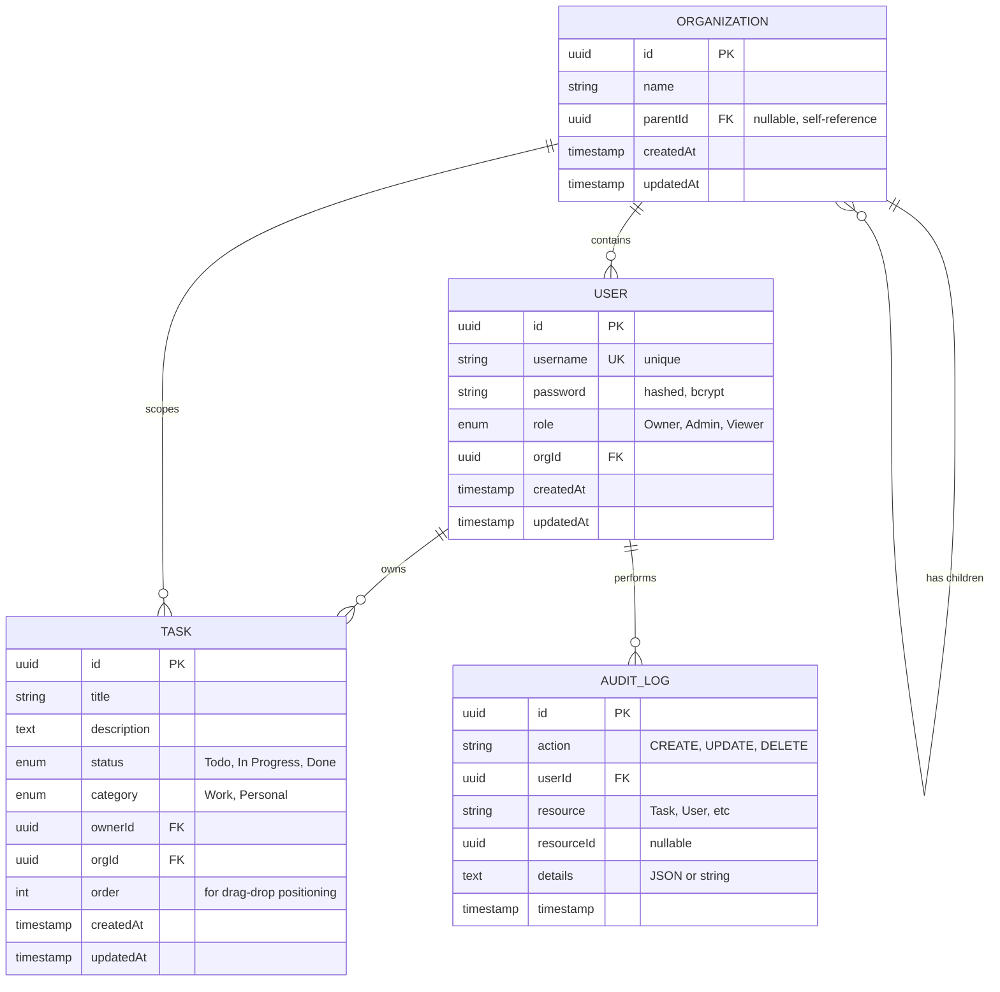
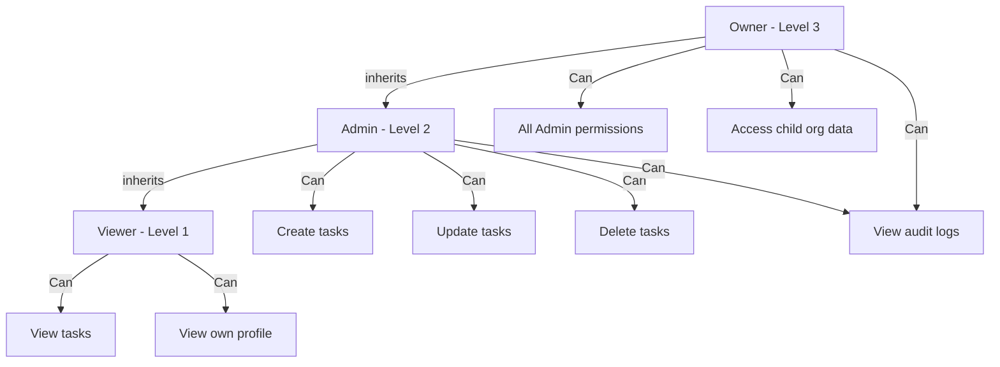
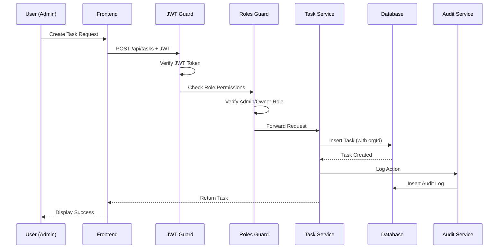

# Entity Relationship Diagram

## Database Schema



## Relationships Explained

### Organization Hierarchy (2-Level)

- **Self-Referencing**: Organizations can have a `parentId` pointing to another organization
- **Example Structure**:
  ```
  Acme Corp (parentId: null)
    └── Acme Research (parentId: Acme Corp.id)
  ```
- **Access Control**: Owners at parent level can access child organization data

### User-Organization Relationship

- **Many-to-One**: Multiple users belong to one organization
- **Role Assignment**: Each user has exactly one role (Owner, Admin, or Viewer)
- **Scoping**: Users can only access data within their organization (and child orgs for Owners)

### Task Ownership

- **Owner**: Each task has one owner (User)
- **Organization Scope**: Tasks are scoped to an organization
- **Visibility**:
  - Viewers: Can see all tasks in their org
  - Admins: Can see and modify all tasks in their org
  - Owners: Can see and modify tasks in their org and child orgs

### Audit Logging

- **Automatic**: All CRUD operations on tasks are logged
- **Traceability**: Each log entry links to the user who performed the action
- **Details**: Stores additional context (e.g., "Created task: Build Login UI")

## Role Hierarchy & Permissions



## Data Flow: Task Creation



## Security Model

### Authentication Flow

1. User submits credentials (username + password)
2. Backend validates against hashed password (bcrypt)
3. JWT token generated with payload: `{ userId, username, role, orgId }`
4. Token stored in localStorage on frontend
5. HTTP Interceptor attaches token to all requests
6. JWT Guard validates token on every protected endpoint

### Authorization Flow

1. JWT Guard extracts user from token
2. Roles Guard checks required roles for endpoint
3. Role hierarchy applied (Owner > Admin > Viewer)
4. Organization scoping enforced in service layer
5. Database queries filtered by `orgId`

## Indexing Strategy (Production Recommendations)

```sql
-- Performance indexes
CREATE INDEX idx_user_orgId ON users(orgId);
CREATE INDEX idx_task_orgId ON tasks(orgId);
CREATE INDEX idx_task_ownerId ON tasks(ownerId);
CREATE INDEX idx_task_status ON tasks(status);
CREATE INDEX idx_audit_userId ON audit_logs(userId);
CREATE INDEX idx_audit_timestamp ON audit_logs(timestamp DESC);
CREATE INDEX idx_org_parentId ON organizations(parentId);
```
